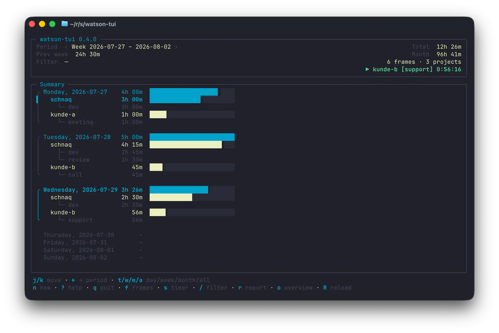
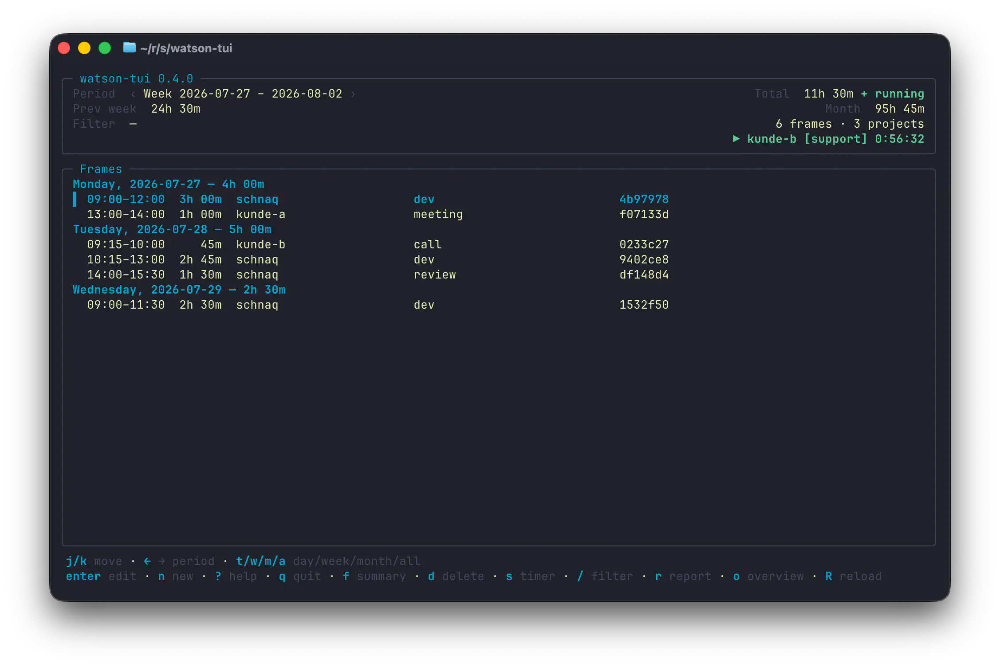
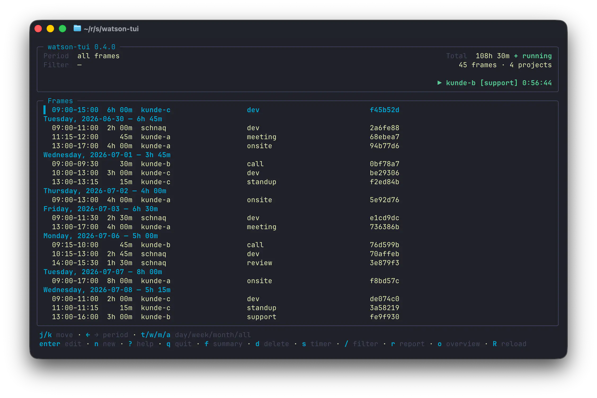
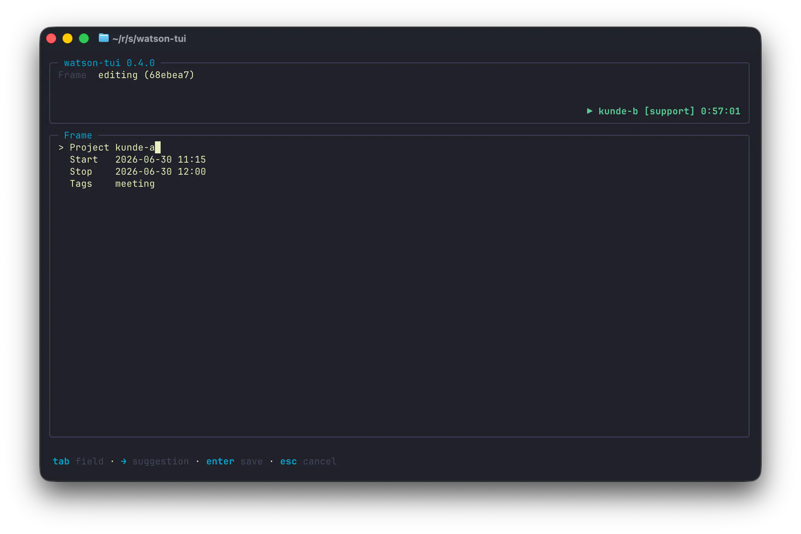
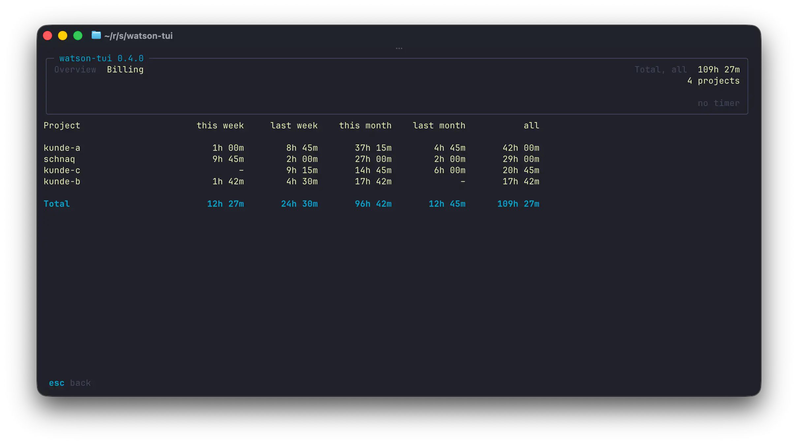

# watson-tui

```
╭ watson-tui           ████████████████████████
│   time, tracked      ██████████████▊░░░░░░░░░
╰   in Go              █████████▎░░░░░░░░░░░░░░
```

A lean terminal UI for [Watson](https://jazzband.github.io/Watson/) time
tracking, in Go. It reads and writes Watson's data format directly — you do not
need Watson installed, and existing data keeps working as it is.



## Installation

```sh
brew tap schnaq/tap
brew install --cask watson-tui
```

The one-liner `brew install --cask schnaq/tap/watson-tui` works too, but
Homebrew has deprecated it (see [Tap-Trust](https://docs.brew.sh/Tap-Trust)).

Updates come through `brew upgrade`. Homebrew casks are macOS-only; on Linux,
grab the matching archive from a
[release](https://github.com/schnaq/watson-tui/releases) (`linux_amd64` or
`linux_arm64`) and put `watson-tui` on your `PATH`.

## Usage

Start `watson-tui` — it opens on the current week, as a summary: one block per
day, the projects worked on that day and, under each, its tags — days and
projects with a bar for how they measure against the strongest day of the
period. That is the question one opens a time tracker with. The individual
sessions are one key away: `f` switches to the frame list and back.



| Key | Action |
|---|---|
| `j`/`k` | move (project rows in the summary, frames in the list) |
| `f` | summary ⇄ frame list |
| `enter` | edit frame (frame list only) |
| `n` | new frame |
| `d` | delete frame (frame list only) |
| `s` | start/stop timer |
| `S` | discard timer |
| `/` | filter (project, tag, ID) |
| `←` / `→` (or `[` / `]`) | previous/next period |
| `t`/`w`/`m`/`a` | day/week/month/everything |
| `r` | report |
| `o` | overview (billing) |
| `R` | reload |
| `?` | help |
| `q` | quit |

The header shows which period you are looking at — the angles `‹ ›` mean `←`
and `→` shift it (`[` and `]` do the same) — plus that period's total, a
comparison against the previous period and the next larger one (for a week,
that is the previous week and the month), the number of frames and projects,
and any running timer. `all frames` cannot be shifted, so it gets neither
angles nor a comparison. The header's total always matches the body underneath
it, so which of the two views you are in decides what it counts: the frame list
shows recorded frames, so its total leaves a running timer out and writes
`+ running` after it — that is exactly why the report and the overview show more
for the same period. The summary's day blocks count a running timer up to now,
like the report, so its total counts it too and carries no such flag.

`a` drops the period entirely and lists every recorded frame, unbounded — the
whole history in one view:



The interface uses your terminal theme's ANSI colours: context header on top,
framed main panel, key hints at the bottom. The chrome hands its space back to
the list in four steps: from 24 terminal lines the header is framed and shows
four field rows above two hint lines; between 20 and 23 lines it stays framed
with three field rows and one hint line; between 14 and 19 it collapses to a
single line; below 14 it disappears. When the hints do not all fit the width,
the trailing ones drop out entirely rather than ending mid-word; when only one
hint line is left, the period keys and the two exits `?` and `q` move into it.
`?` shows the full key map; it fits any terminal that still has a header (from
14 lines up), below that its tail is cut off.

The frame list adapts to the width as well, in this order: from about 88
columns the tags shrink (with `…`), below about 60 they are gone and the
project name shrinks, below about 42 the ID column drops **entirely**, below
about 24 the start and end times go too. Only labels are ever shortened. The
duration always stays complete, and the ID is shown either with all seven
characters or not at all: Watson resolves IDs by their prefix, so a shortened ID
would match several frames — or the wrong one. You always get the full ID in the
edit dialog (`enter`) and in the delete prompt (`d`). The exact thresholds
depend on the widest duration in the list — `130h 00m` needs one column more
than `6h 30m`.



The summary reads down three columns: a rail that brackets each day, the names
with their durations, and a bar.

```
╭ Monday, 2026-07-20    6h 30m  ████████████████████████
│   kunde-a             4h 00m  ██████████████▊░░░░░░░░░
│     ├─ meeting        4h 00m
│     └─ onsite         4h 00m
│   schnaq              2h 30m  █████████▎░░░░░░░░░░░░░░
╰     └─ dev            2h 30m

  Tuesday, 2026-07-21        –
```

The **bar** is a share of the strongest day of the period, one scale for the
whole view — so a quiet day looks quiet, and the projects of a day add up to
exactly their day's bar rather than each filling the width. Any duration above
zero occupies at least a sliver: a row that rendered as nothing would say
nothing was booked, which is a different claim from "not much was". Tag rows
carry no bar, because tags are counted individually and two of them on one frame
would together outrun the project above.

The **rail** opens with `╭` on a day that was worked and closes with `╰` under
its last line; an empty day gets none. The cursor's `▌` takes that column while
it is on a row, so the line keeps its width.

The current day's line is **bold** and its rail carries the accent colour, a day
that was worked is plain, and a day without a recorded frame is dimmed — shown
all the same, with `–` instead of `0m`, so a gap in the week is visible rather
than merely absent.

Against the width the summary has one elastic column: the day, project or tag
name is shortened with `…` while its duration stays whole. The durations stand
in one column across all three kinds of row, sized to the longest name the view
actually shows rather than pinned to the right edge of the terminal — so the
number follows the name it belongs to instead of standing sixty columns away
from it. The bar is sized last, from what is left, and below ten columns it
**drops whole**: narrower than that it can no longer tell a tenth from a half,
and a bar showing the wrong proportion is worse than none — the same rule the
frame list's ID column follows. A terminal that narrow therefore shows exactly
what it did before the bar existed. Long project names can use up the room the
bar wanted, and then it goes for the same reason; the name is the information.

Data directory: `$WATSON_DIR`, otherwise the OS default (macOS:
`~/Library/Application Support/watson`). Override with `--dir PATH`.

### Report and overview

The report (`r`) sums the selected period per project, with the tag totals
below each one. Tags are counted individually: a frame with two tags counts
towards both, so the tag totals can exceed the project total. They answer "how
much time per tag", not "how does this project break down".

The overview (`o`) is the billing view: totals per project across this week,
last week, this month, last month and everything. The table adapts to the
terminal width: below about 78 columns the month column titles are shortened
(`prev mo`), below about 70 the project column shrinks as well.
Below about 62 columns whole value columns drop out — which ones is printed
above the table, and `all` always stays. No duration is ever cut off.



**How time is attributed to a period** — this matters if you write invoices
from it:

- A frame counts in full towards the period it **starts** in. A session from
  31 July 23:00 to 1 August 02:00 therefore counts three hours towards July,
  not split across the two. Watson itself does the same.
- A running timer counts up to now and is called out below the table — in the
  overview and the report alike, and in the summary's day blocks and header
  total too. Only the frame list leaves it out, because it lists recorded
  frames and nothing else; its header total therefore still adds up to the day
  totals below it, and writes `+ running` after itself.
- Everything is based on your local time zone; the week start comes from
  Watson's `config` (`[options] week_start`, Monday by default).

## Development

See [`docs/CONTRIBUTING.md`](docs/CONTRIBUTING.md) (governed by the
[Code of Conduct](docs/CODE_OF_CONDUCT.md)).

```sh
go test ./...
WATSON_DIR=$(mktemp -d) go run ./cmd/watson-tui
```

To reproduce screenshots like the ones above without touching real tracked
time, generate a throwaway data directory and point `--dir` at it:

```sh
go run scripts/gen-demo-data.go   # writes ./demo-data
go run ./cmd/watson-tui --dir demo-data
```

Releases: push a `v*` git tag — GitHub Actions builds with GoReleaser and
updates the Homebrew cask in
[schnaq/homebrew-tap](https://github.com/schnaq/homebrew-tap).

---

<p align="center">
  <a href="https://schnaq.com">
    
  </a>
</p>

<p align="center">
  <sub>
    watson-tui started as an internal tool for tracking our own time at
    <a href="https://schnaq.com">schnaq</a> — we open-sourced it because a
    terminal-first Watson client didn't otherwise exist.
  </sub>
</p>
